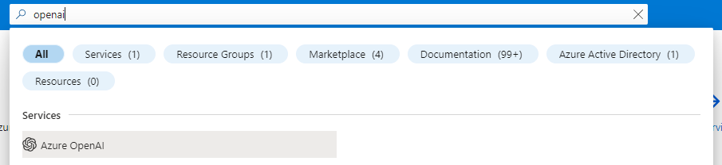
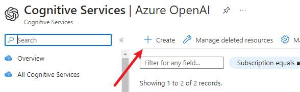
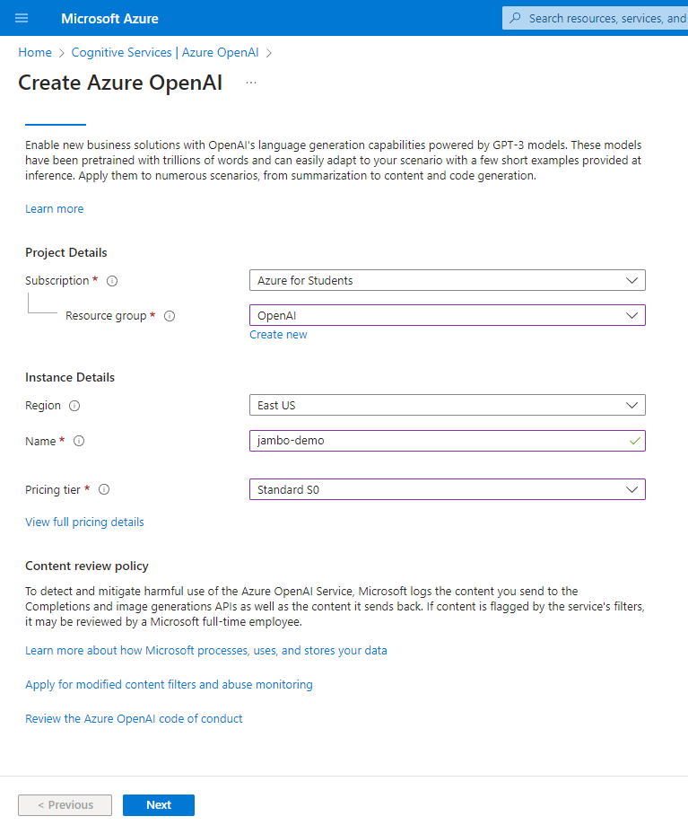
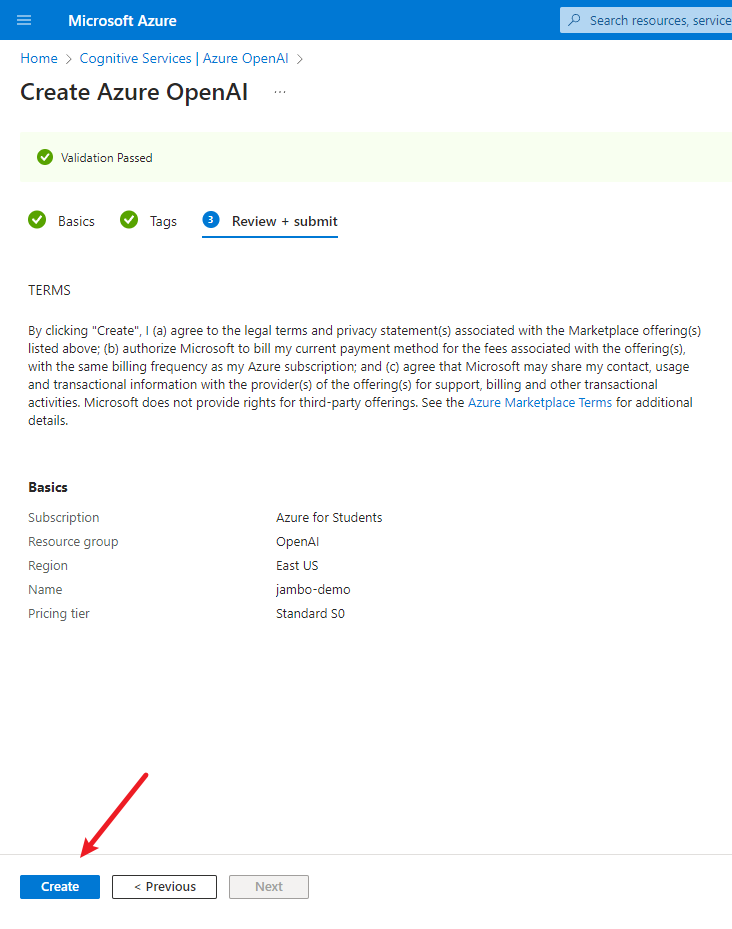
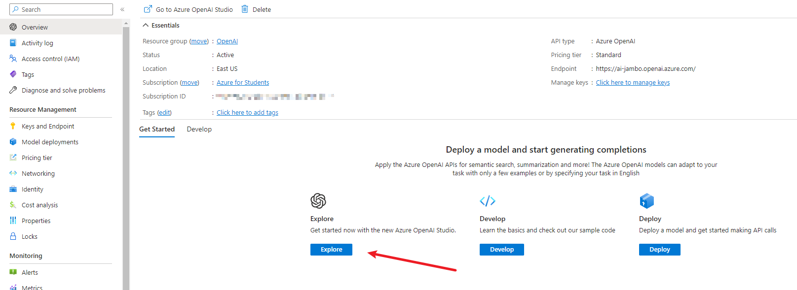
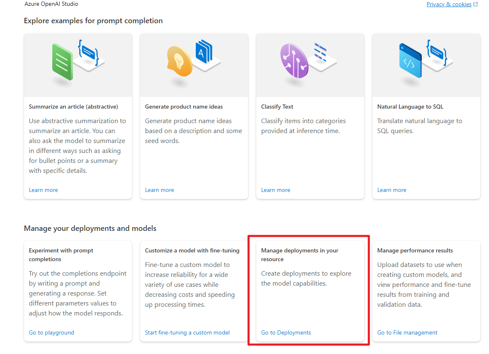
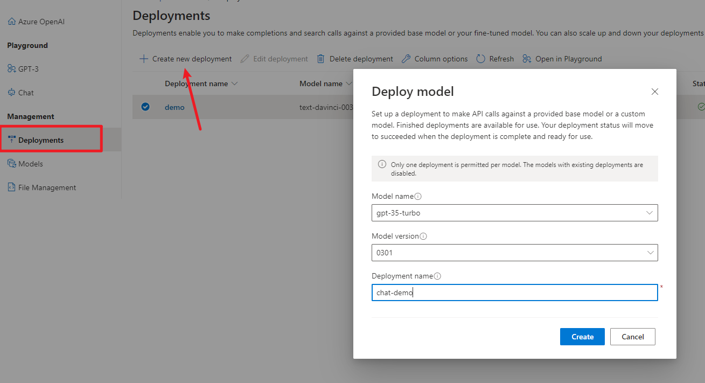
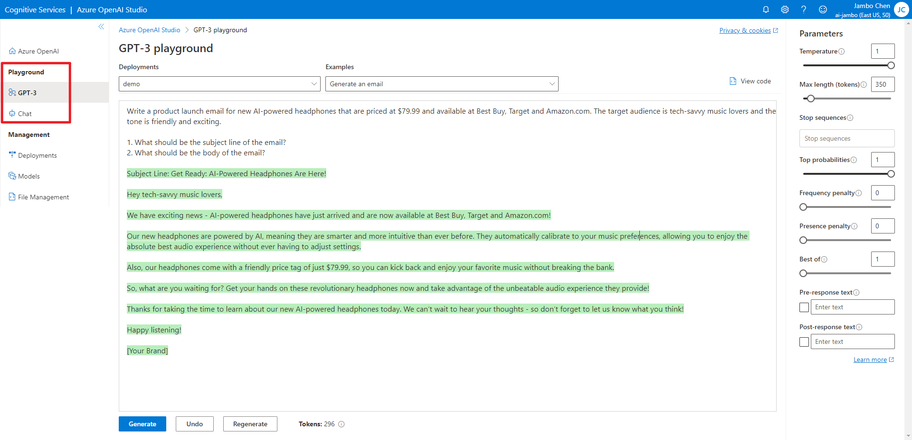
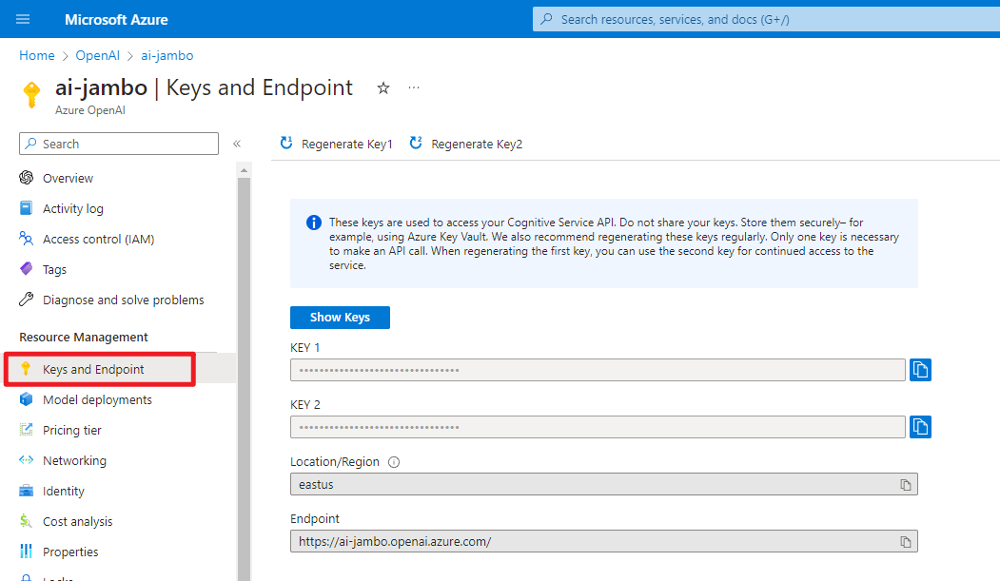

# 来 Azure 学习 OpenAI 三 - 用 Python 调用 Azure OpenAi API
  
加上大家好，我是微软学生大使 Jambo。在我们申请好 Azure 和 Azure OpenAI 之后，我们就可以开始使用 OpenAI 模型了。如果你还没有申请 Azure 和 Azure OpenAI，可以参考 [注册 Azure 和申请 OpenAI](https://blog.csdn.net/chenjambo/article/details/129783819 )。
  
本文将会以 Azure 提供的 Openai 端口为例，并使用 OpenAI 提供的 [Python SDK](https://github.com/openai/openai-python ) 进行模型的调用。
  
## 创建工作区
  
进入 Azure 首页，在搜索栏中输入 OpenAI，点击进入 OpenAI 页面。
  

  
点击创建。
  

  
选择订阅，资源组，工作区名称，工作区地区，点击创建。这里我们地区选择 “美东” ，因为目前只有这个地区支持 chatgpt 对话模型。如果你不需要对话模型，可以选择其他模型种类更多的 “西欧”。
  

  
选择下一步，确认无误后点击创建。
  

  
等他创建完成后，点击 “探索” 进入工作区。
  

  
## 模型介绍
  
在使用模型之前，我们先来了解一下 Azure 提供了哪些 OpenAI 模型。Azure 提供的模型从功能上可以分为三大类：补全（completion）、对话（chat）、嵌入（embeddings）。
  
补全模型可以根据输入的文本，补全剩余的文本。这类模型顾名思义，就是根据前文续写后续的部分。他可以用来续写文章，补全程序代码。不仅如此，你其实也可以通过固定的文字格式来实现对话的效果。
  
对话模型相信有使用过 ChatGPT 的同学应该很熟悉。对话模型可以根据输入的文本，生成对话的回复。这类模型可以用来实现聊天机器人，也可以用来实现对话式的问答系统。在调用方面，对话模型与补全模型最主要的区别是：你需要一个列表来存储对话的历史记录。
  
没接触过过 NLP（自然语言处理） 的同学可能会对 “嵌入” 这个词感到疑惑。“嵌入” 实际上就是将文本转换为向量的操作，而这个向量可以用来表示文本的语义信息，这样就可以方便地比较语义的相似度。而嵌入模型就是用来实现这个操作的。
  
大部分模型拥有多个能力等级，能力越强能处理的文字也就越复杂，但相对的处理速度和使用成本也就越高。通常有 4 个等级：Davinci > Curie > Babbage > Ada ，其中 Davinci 最强而 Ada 是最快的（有兴趣的同学可以查一下这 4 位名人）。在使用模型时，你可以根据自己的需求选择合适的等级。
  
具体的模型介绍可以参考 [Azure OpenAI 服务模型](https://learn.microsoft.com/azure/cognitive-services/openai/concepts/models )。
  
## 部署模型
  
在了解了模型的功能和等级之后，我们就可以开始使用模型了。在使用模型之前，我们需要先部署模型。在 Azure OpenAI 工作区中，进入 “部署” 页面。
  

  
选择模型，点击创建。这里我部署了一个补全模型和对话模型。
  

  
部署后你就可以用 API 调用模型了，当然你也可以现在 Playground 中测试一下。
  


## API 参数

在 Playground 中测试模型时，我们可以看到 API 的参数。这里我们来介绍一下这些参数。具体的参数细节可以参考 [API Reference](https://platform.openai.com/docs/api-reference/completions/create)。

- `model` 指定使用的模型。
- `prompt` 是输入给模型的文本。
- `temperature` 控制了生成文本的随机程度，值越大，生成的文本越随机，值越小，生成的文本越稳定。这个值的范围在 0.0 到 2.0 之间（虽然在 Playground 中最高只能设为 1）。
- `top_p` 与 `temperature` 类似，也是控制生成文本的随机程度。但这个参数简单的说是控制候选词的范围，值越大，候选词的范围越大，值越小，候选词的范围越小。这个值的范围在 0.0 到 1.0 之间。通常来说，这两个参数只需要设置一个就可以了。
- `max_tokens` 是模型生成的文本的最大长度，这其中的 “token” 不是指字符长度，你可以把他理解为模型眼中的 “词”。Token 与我们所使用的词不一定是一一对应的。
- `stop` 是生成文本的停止条件，当生成的文本中包含这个字符串时，生成过程就会停止,最终生成的文本中将不包含这个字符串。这个参数可以是一个 string，也可以是一个长度至多为 4 的 string 列表。
- `presence_penalty` 控制生成文本的多样性。他会惩罚那些在生成文本中已经出现过的 token，以减小未来生成这些 token 的概率。这个值的范围在 -2.0 到 2.0 之间。如果设为负值，那么惩罚就会变为奖励，这样就会增加生成这些 token 的概率。
- `frequency_penalty` 与 `presence_penalty` 类似，也是控制生成文本的多样性。但不同的是，`presence_penalty` 是一次性惩罚，而 `frequency_penalty` 累计惩罚。如果一个词在生成文本中出现了多次，那么这个词在未来生成的概率就会越来越小。这个值的范围同样在 -2.0 到 2.0 之间。

## 计算 Token

GPT 模型使用 token 来表示文本，而不是使用字符。模型能处理的文本长度是有限的，而这个长度指的是 token 的数量，而不是字符的数量，并且 OpenAI 使用模型的计费方式也是按照生成 token 的数量计算。因此为了能够更好地使用模型，我们需要知道生成的文本究竟有多少 token。

OpenAI 提供了一个 Python 库 [tiktoken](https://github.com/openai/tiktoken) 来计算 token。

```bash
pip install tiktoken
```

导入 tiktoken 库。

```python
import tiktoken
```

不同模型使用不同的编码来将文本转换为 token。
| Encoding name           | OpenAI models                                       |
|-|-|
| `cl100k_base`           | `gpt-4`, `gpt-3.5-turbo`, `text-embedding-ada-002`  |
| `p50k_base`             | Codex models, `text-davinci-002`, `text-davinci-003`|
| `r50k_base` (or `gpt2`) | GPT-3 models like `davinci`  |

我们可以使用 `tiktoken.get_encoding()` 来获取编码对象。也可以使用 `tiktoken.encoding_for_model()` 通过模型名自动获取编码对象。

```python
encoding = tiktoken.get_encoding("cl100k_base")
encoding = tiktoken.encoding_for_model("gpt-3.5-turbo")
```

然后用 `.encode()` 方法将文本 token 化。返回的 token 列表的长度，就是这段文本的 token 数量。

```python
encoding.encode("tiktoken is great!")
```

```txt
[83, 1609, 5963, 374, 2294, 0]
```

我们还可以使用 `.decode()` 将 token 列表转换为文本。

```python
encoding.decode([83, 1609, 5963, 374, 2294, 0])
```

```txt
'tiktoken is great!'
```

## 使用 Python SDK
  
我们首先需要到 Azure 的 “密钥” 页面获取密钥和终结点，两个密钥只要其中一个即可。
  

  
然后安装 openai 库。注意，Python 版本需要大于等于 3.7。我们这里使用官方提供的 [Python SDK](https://github.com/openai/openai-python )，其他语言的 SDK 可以在 [OpenAI Libraries](https://platform.openai.com/docs/libraries ) 找到。
另外，因为这个库没有专门的文档参考，所以我们需要查看[库的源码](https://github.com/openai/openai-python/tree/main/openai )和 [API 参考](https://platform.openai.com/docs/api-reference )。
  
```bash
pip3 install openai
```
  
更具先前获取的密钥和终结点初始化 SDK：
  
```python
import openai

openai.api_key = "REPLACE_WITH_YOUR_API_KEY_HERE"    # Azure 的密钥
openai.api_base = "REPLACE_WITH_YOUR_ENDPOINT_HERE"  # Azure 的终结点
openai.api_type = "azure" 
openai.api_version = "2023-03-15-preview" # API 版本，未来可能会变
model = ""  # 模型的部署名
```
  
### 调用补全模型
  
补全模型使用的是 `openai.Completion.create` 方法，使用的参数在上面已经介绍过了，但因为我使用的是 Azure 的 API，所以指定模型的参数名是 `engine`。下面是一个简单的例子：
  
```python
prompt = "1, 2, 3, 4, "
response = openai.Completion.create(
    engine=model, prompt=prompt, max_tokens=50, temperature=0.0
)
print(response)
```

它打印出的内容就是 API 返回的 json 结果。其中 `text` 就是模型生成的文本，可以看到它将数列续写下去。但他只停在 21，是因为我设置了 `max_tokens=50`，可以看到 `usage` 中的 `completion_tokens` 是 50，也就是说模型生成了 50 个 token，达到了最大值，而 `finish_reason` 是 `length`，表示是因为达到了最大长度而停止的。如果是因为写完了而停止，那么 `finish_reason` 的值会是 `stop`。
  
```json
{
  "choices": [
    {
      "finish_reason": "length",
      "index": 0,
      "logprobs": null,
      "text": "5, 6, 7, 8, 9, 10, 11, 12, 13, 14, 15, 16, 17, 18, 19, 20, 21,"
    }
  ],
  "created": 1680628906,
  "id": "cmpl-71edm7DMgHrynaiXONWi4ufSrXiL0",
  "model": "gpt-35-turbo",
  "object": "text_completion",
  "usage": {
    "completion_tokens": 50,
    "prompt_tokens": 12,
    "total_tokens": 62
  }
}
```

此外你或许有注意到，我使用的模型是 “gpt-35-turbo”。他虽然是对话模型，但他实际上也可以通过补全 API 使用。但同样是对话模型的 “gpt-4” 就只能通过对话 API 使用。

接下来我们在其中加个停止条件，让他数到 11 就停止：
  
```python
prompt = "1, 2, 3, 4, "
response = openai.Completion.create(
    engine=model, prompt=prompt, temperature=0.0, stop=["11"]
)
print(response["choices"][0])
```
  
可以看到他确实是停在 11 之前，并且 `finish_reason` 的值是 `stop`。
  
```json
{
  "finish_reason": "stop",
  "index": 0,
  "logprobs": null,
  "text": "5, 6, 7, 8, 9, 10, "
}
```
  
但如果我们将 `temperature` 的值调高，它可能会生成意料之外的文本：
  
```python
prompt = "1, 2, 3, 4, "
response = openai.Completion.create(
    engine=model, prompt=prompt, temperature=0.8, stop=["11"]
)
print(response["choices"][0])
```
  
```json
{
  "finish_reason": "length",
  "index": 0,
  "logprobs": null,
  "text": "5, 6, 7, 8, 9, 10])) # 55\nprint(sum_list([0, 0, 0, 0, 0])) # 0\nprint(sum_list([1, -"
}
```
  
### 调用对话模型
  
对话模型使用的是 `openai.ChatCompletion.create` 方法，它的参数和补全模型的参数类似，但有一些不同：对话模型输入的是一个对话历史，而不是单个的文本。并且其参数名是 `messages`，而不是 `prompt`。
  
对话历史是一个列表，列表中的每个元素都是一个对话，每个对话又是一个字典，字典中有两个键：`role` 和 `content`。`role` 是对话的角色，而 `content` 是对话的内容。下面是个简单的例子：
  
```python
messages=[
    {"role": "system", "content": "You are a helpful assistant."},
    {"role": "user", "content": "Knock knock."},
    {"role": "assistant", "content": "Who's there?"},
    {"role": "user", "content": "Orange."},
]
```
  
可以看到 `role` 的值有 `system`、`user` 和 `assistant`。`user` 就是指用户，`assistant` 代表的就是和你对话的 AI 模型，而 `system` 可以理解为 `assistant` 的设置、人设等等。当然 `system` 也可以省略。
  
接下来我们用此对话历史来调用对话模型：
  
```python
response = openai.ChatCompletion.create(
    engine=model, messages=messages
)
response
```
  
```json
{
  "choices": [
    {
      "finish_reason": "stop",
      "index": 0,
      "message": {
        "content": "Yes, many other Azure Cognitive Services do support the use of customer managed keys for encrypting and protecting data. In fact, most Azure services that handle sensitive data can be configured to use customer managed keys for enhanced security and compliance. Some examples of Azure Cognitive Services that support customer managed keys include Azure Cognitive Services Speech Services, Azure Cognitive Services Text Analytics, and Azure Cognitive Services Translator Text.",
        "role": "assistant"
      }
    }
  ],
  "created": 1680633366,
  "id": "chatcmpl-71fnivs89GKEMKpzwuCCxbH0MNP98",
  "model": "gpt-35-turbo",
  "object": "chat.completion",
  "usage": {
    "completion_tokens": 79,
    "prompt_tokens": 58,
    "total_tokens": 137
  }
}
```
  
我们可以维护一个对话历史，然后每次调用对话模型时，将新的对话加入到对话历史中，以此循环来实现一个对话系统：
  
```python
conversation = [{"role": "system", "content": "You are a helpful assistant."}]
  
while True:
    user_input = input()
    conversation.append({"role": "user", "content": user_input})
  
    response = openai.ChatCompletion.create(
        engine=model,
        messages=conversation,
    )
  
    conversation.append(
        {"role": "assistant", "content": response["choices"][0]["message"]["content"]}
    )
    print("\n" + response["choices"][0]["message"]["content"] + "\n")
```
  
### 流式调用
  
所谓 “流式” ，就是服务器生成了什么内容就立即返回给客户端，而不是等全部都完成后再统一返回。最典型的例子就是各种视频网站，你在播放视频时，视频的内容是随着时间的推移而不断加载的，而不是等到视频加载完毕后再一次性播放。这样做的好处是可以让用户更快的看到内容。ChatGPT 那样像一个字一个字写出来的效果就是通过流式形成的。
  
但他的缺点是，服务器将不会帮你统计生成的 token，你需要自己统计。
  
以下是一个一般调用的例子：
  
```python
response = openai.ChatCompletion.create(
    engine=model,
    messages=[
        {'role': 'user', 'content': "Count to 10. E.g. 1, 2, 3, 4, ..."},
    ],
    temperature=0,
)
  
print(response)
```
  
```json
{
  "choices": [
    {
      "finish_reason": "stop",
      "index": 0,
      "message": {
        "content": "\n\n1, 2, 3, 4, 5, 6, 7, 8, 9, 10.",
        "role": "assistant"
      }
    }
  ],
  "created": 1680709601,
  "id": "chatcmpl-71zdJtUaOIhfnVsAKLyD88RtGzgQb",
  "model": "gpt-35-turbo",
  "object": "chat.completion",
  "usage": {
    "completion_tokens": 31,
    "prompt_tokens": 28,
    "total_tokens": 59
  }
}
```
  
但我们只要将 `stream` 参数设置为 `True` ，就可以使用流式调用了：
  
```python
response = openai.ChatCompletion.create(
    engine=model,
    messages=[
        {'role': 'user', 'content': "Count to 10. E.g. 1, 2, 3, 4, ..."},
    ],
    temperature=0,
    stream=True,
)
print(next(response))
for chunk in response:
    print(chunk['choices'])
```
  
```json
{
  "choices": [
    {
      "delta": {
        "role": "assistant"
      },
      "finish_reason": null,
      "index": 0
    }
  ],
  "created": 1680710012,
  "id": "chatcmpl-71zjwZk3EB5fLgVup9S1BPZo73JUk",
  "model": "gpt-35-turbo",
  "object": "chat.completion.chunk",
  "usage": null
}
[<OpenAIObject at 0x1e2ba8fdc10> JSON: {
  "delta": {
    "content": "\n\n"
  },
  "finish_reason": null,
  "index": 0
}]
[<OpenAIObject at 0x1e2ba8fe870> JSON: {
  "delta": {
...
  "delta": {},
  "finish_reason": "stop",
  "index": 0
}]
```
  
因为长度原因，除了第一个块，其他都只打印了 `choices` 的内容，但其余的部分都是一样的，甚至是 `id`。
可以看到，第一个块的 `delta` 里面只有 `role` ，而后面的块里面的 `delta` 里面有 `content` ，这就是服务器生成的内容。我们只要把这些内容拼接起来就可以了：
  
```python
response = openai.ChatCompletion.create(
    engine=model,
    messages=[
        {"role": "user", "content": "Count to 10. E.g. 1, 2, 3, 4, ..."},
    ],
    temperature=0,
    stream=True,
)
  
message = next(response)["choices"][0]["delta"]
content = "".join(
    [chunk["choices"][0]["delta"].get("content", "") for chunk in response]
)
message["content"] = content
print(message)
```
  
```python
{
  "content": "\n\n1, 2, 3, 4, 5, 6, 7, 8, 9, 10.",
  "role": "assistant"
}
```
  
### 异步调用
  
在我们写诸如网站、爬虫之类的程序时，经常会遇到类似调用数据库、API 的情况，这些操作都是需要漫长的等待，在等待的过程中，程序会处于阻塞状态，无法继续执行后面的代码。可这些操作的瓶颈通常不在于程序本身，而是在于网络或者硬盘的速度，这时候我们就可以使用异步来解决这个问题。
  
异步可以让我们等待结果的同时，继续执行其他的代码，这样就不会阻塞程序的执行了。我们在这里就不多介绍 Python 的异步和其语法，这超出了本文的范围，有兴趣的同学可以自行学习。本文将着重于 SDK 的异步调用。
  
OpenAI SDK 的异步调用和同步调用的区别在于，异步调用需要使用 `acreate` 方法，而不是 `create` 方法。这里的 `a` 表示异步。`acreate` 方法的返回值是一个 `coroutine` 对象，而不是一个 `OpenAIObject` 对象，所以我们不能直接使用 `print` 来打印它，而是需要使用 `await` 来等待它的结果。
  
```python
async def async_completion():
    response = await openai.ChatCompletion.acreate(
        engine=model,
        messages=[
            {"role": "user", "content": "Count to 10. E.g. 1, 2, 3, 4, ..."},
        ],
        temperature=0,
    )
    return response["choices"][0]["message"]
print(await async_completion())
```
  
```python
{
  "content": "\n\n1, 2, 3, 4, 5, 6, 7, 8, 9, 10.",
  "role": "assistant"
}
```
  
OpenAI SDK 的异步请求默认是使用 `aiohttp` 第三方异步请求库的 session。SDK 在每次请求时都会新建一个 session，这会造成一部分的开销，因此如果你的程序需要频繁的异步请求，那么你可以自己传入一个 `aiohttp.ClientSession` 对象，这样就可以复用 session 了。另外要注意的是，如果你使用了自己的 session，那么你需要在程序结束时手动关闭它，以免造成其他问题：
  
```python
from aiohttp import ClientSession
  
openai.aiosession.set(ClientSession())
res = await asyncio.gather(*[async_completion() for _ in range(10)])
await openai.aiosession.get().close()
```
  
## 提示技巧
  
OpenAI 的模型基于你输入的文本，也就是提示（Prompt）来生成后续的文字，它可以做很多事情，正因如此，你需要明确的表达你想要什么。在一些时候，仅仅是描述是不够的，你还需要给模型展示出你想要的结果，比如列举几个例子。下面三点是创建提示的基本准则：
  
- **展示和讲述。** 通过指示、示例或两者结合，清楚地表明你的需求。
- **提供优质数据。** 如果您试图构建分类器或让模型遵循某种模式，请确保有足够的示例。。
- **检查设置。** `Temperature` 和 `top_p` 控制模型在生成响应时的确定性程度。如果你想要模型输出确定性的答案，将值设低一些；如果你想要模型输出更多的选择，将值设高一些。通常这两个值同时只需要调整一个就可以了。在生成文字时，你可能需要经常调整这些设置，以确保输出的正确性。
  
另外，虽然以下例子都是使用完成模型，但这些提示原则同样适用于聊天模型。
  
### 生成
  
产生文本和想法几乎是 OpenAI 的最基本功能，它可以用来生成代码、文章、故事、歌词、对话等等。在这里，我们将使用 `Completion` 类来完成这个任务。下面是个很简单的例子：


这虽然只是个非常简单的例子，但其中还是有些值得注意的细节：
  
1. 我们首先描述了我们的意图，即生成一段关于 Python 优势的列表。
2. 我们提供了一个示例，这样模型就知道我们想要的是一个列表。并且只是说明优势，而不用具体阐述。
3. 我们留了一个 “2. ”，以此引导模型继续生成。

### 对话

生成模型在经过引导后也可以用于对话。当然，只是简单的提示可能不足以让模型理解你的意思，你可以给他提供一些示例对话，这样他就可以跟着对话续写下去：


为了避免让他生成过头，把我们的话也一起生成了，我们可以使用 `stop` 参数来进行限制。比如在这里，我把 `stop` 参数设置的是 “博士：”，这样当他生成到这个字符前，就会停止。
  
### 分类
  
下面的例子中，我在《巫师3》的评论区中选了 5 条，并让他分类为好评或差评：


