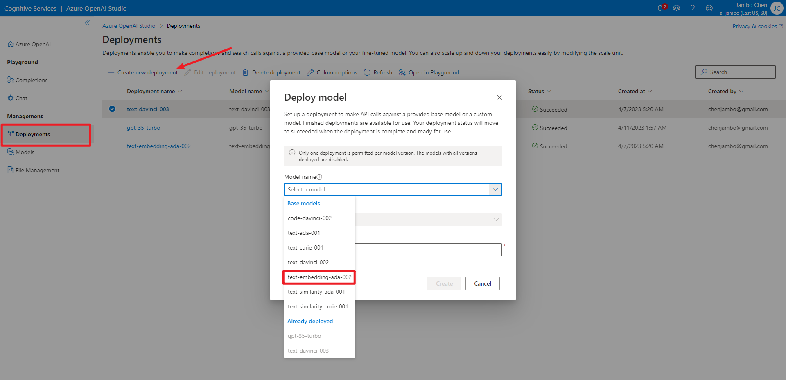
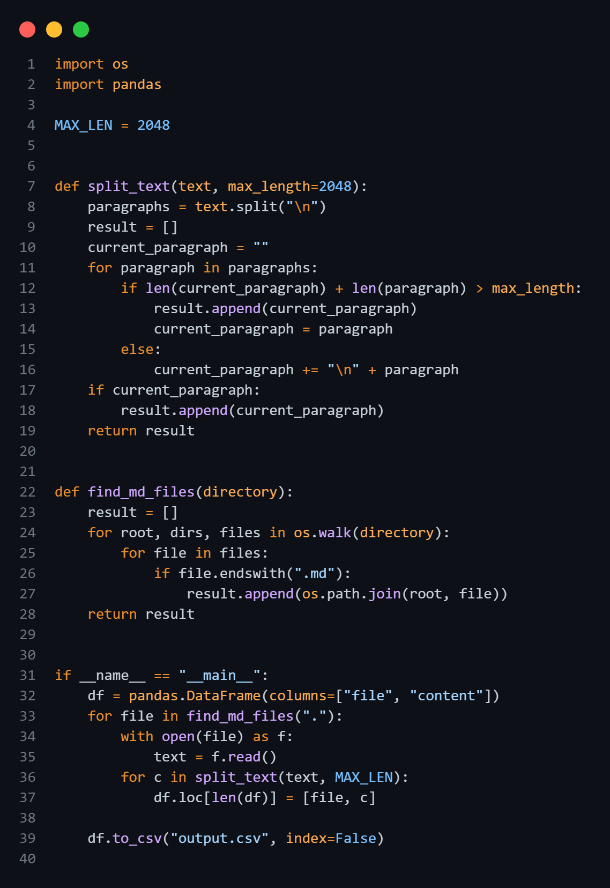
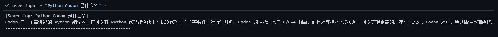

# 来 Azure 学习 OpenAI 四 - 用 Embedding 赋能 GPT

大家好，我是学生大使 Jambo。在我们前一篇文章中，我们介绍了 OpenAI 模型的调用。今天，我将为大家介绍 Embedding 的使用。

## 嵌入是什么

嵌入（Embedding ）是一种将高维数据映射到低维空间的方法。嵌入可以将高维数据可视化，也可以用于聚类、分类等任务。嵌入可以是线性的，也可以是非线性的。在深度学习中，我们通常使用非线性嵌入。非线性嵌入通常使用神经网络实现。

上面这句话对于没接触过 NLP（自然语言处理）的同学来说可能有点抽象。你可以理解为通过嵌入，可以将文字信息压缩、编码成向量（或者不准确的称之为数组），而这个向量包含了这段文字的语义。我们可以将这个技术用于搜索引擎、推荐系统等等。

## 调用 Embedding 模型

与前篇一样，我们需要先部署模型。这里我们使用 `text-embedding-ada-002`。



然后安装 `openai` 包。用以下命令安装，会将 numpy、pandas 等库一并安装。

```bash
pip install openai[datalib]
```

接下来导入 `openai`，并做一些初始化工作。

```python
import openai

openai.api_key = "REPLACE_WITH_YOUR_API_KEY_HERE"    # Azure 的密钥
openai.api_base = "REPLACE_WITH_YOUR_ENDPOINT_HERE"  # Azure 的终结点
openai.api_type = "azure" 
openai.api_version = "2023-03-15-preview" # API 版本，未来可能会变
model = "text-embedding-ada-002"  # 模型的部署名
```

```python
embedding = openai.Embedding.create(
    input="苹果", engine="text-embedding-ada-002"
)
print(embedding1)
```

```txt
{
  "data": [
    {
      "embedding": [
        0.011903401464223862,
        -0.023080304265022278,
        -0.0015027695335447788,
        ...
    ],
      "index": 0,
      "object": "embedding"
    }
  ],
  "model": "ada",
  "object": "list",
  "usage": {
    "prompt_tokens": 3,
    "total_tokens": 3
  }
}
```

其中 `embedding` 就是 “苹果” 所对应的向量。

## 计算向量相似度

在我们将文字转换成向量之后，我们讨论两句话的相似度，其实就是问它们所对应向量的相似度。通常我们使用余弦相似度来衡量两个向量的相似度。

余弦相似度是计算两个向量夹角角度的 $\cos$ 值，取值范围在 -1 和 1 之间。如果两个向量的方向完全一致，那么它们的余弦相似度为 1；如果两个向量的方向完全相反，那么它们的余弦相似度为 -1；如果两向量是垂直（正交）的，那么它们的余弦相似度为 0。其公式如下：
$$
\cos(\theta) = \frac{\vec A \cdot \vec B}{\|\vec A\| \|\vec B\|}
$$

$\vec A$ 和 $\vec B$ 分别是两个向量，$\theta$ 是两个向量的夹角。而 $\|\vec A\|$ 和 $\|\vec B\|$ 分别是向量 $\vec A$ 和 $\vec B$ 的长度（模长）。因为 OpenAI 的 Embedding 模型返回的是单位向量，即向量的长度为 1，所以我们不需要计算模长，而它们的夹角就是两个向量的点积。

$$
\cos(\theta) = \frac{\vec A \cdot \vec B}{1 \cdot 1} = \vec A \cdot \vec B
$$

有的人可能会疑惑为什么不用欧式距离来计算。在这种向量长度都为 1 的情况下，欧式距离和余弦相似度其实是等价的，它们之间是可以互相转换的。

在 Python 中，我们可以使用 `numpy` 库来计算两个数列的余弦相似度：

```python
import numpy as np

# 计算两个向量的余弦相似度
def cosine_similarity(a, b):
    return np.dot(a, b)  # 计算点积
```

下面是个简单的例子：

```python
embedding1 = openai.Embedding.create(
    input="苹果", engine="text-embedding-ada-002"
)["data"][0]["embedding"]
embedding2 = openai.Embedding.create(
    input="apple", engine="text-embedding-ada-002"
)["data"][0]["embedding"]
embedding3 = openai.Embedding.create(
    input="鞋子", engine="text-embedding-ada-002"
)["data"][0]["embedding"]

print(cosine_similarity(embedding1, embedding2))
print(cosine_similarity(embedding1, embedding3))
print(cosine_similarity(embedding2, embedding3))
```

```text
0.8823086919469535
0.8256366789720779
0.7738048005367909
```

## 用 Embedding 加强 GPT 的能力

GPT模型非常强大，它能够根据训练的数据回答问题。但是，它只能回答那些在训练时获取到的知识，对于训练时获取不到的知识，它一无所知。所以对于类似“明天天气如何”，或者企业内部的一些专业知识，GPT模型就无能为力了。

天气等及时性较强的内容，我们可以通过搜索引擎获得相关的信息。而像新闻报道或是文档这类内容，通常篇幅较长，可 GPT 模型能处理的文字有限，因此我们需要将其分割成多个段落，然后找到其中最相关的段落，再将其与问题一起传入 GPT 模型中。而如何找到最相关的段落呢？这就需要用到 Embedding 模型了。将分割后的段落传入 Embedding 模型，得到每个段落的向量，然后计算与问题的相似度，最后找到最相似的段落。特别是本地文档，我们可以事先将其转换成向量，然后保存下来，这样就可以快速地找到最相关的段落。

下面我用 [Codon 的文档](https://github.com/exaloop/codon/tree/develop/docs)作为资料来源，并让 GPT 可以根据文档里的内容进行回答。

### 预处理文档

我用下面的代码将文档分割成多个段落，并且保证每段字数不超过 2048：



然后将这些段落传入 Embedding 模型，得到每个段落的向量。这里我没有使用异步，这是为了避免触发 API 的速率限制。为了演示方便，我只是将数据保存在 csv 文件中，实际使用时，我们可以将数据保存到 Pinecone，Milvus 等向量数据库中。


### 制作 Prompt

为了让 GPT 只回答文档里的内容，我们首先要将这件事告诉 GPT，并且我们还需要传入与问题相关的段落。

```python
prompt_prefix = """
你是一个客服，回答用户关于文档的问题。
仅使用以下资料提供的事实进行回答。 如果下面没有足够的信息，就说你不知道。不要生成不使用以下资料的答案。

资料：
{sources}
"""
```

有时我们提问的问题可能会与先前的对话相关，因此为了更好的匹配文档段落，我们将对话历史和新的问题告诉 GPT，并让它帮我们生成一个查询语句。

```python
summary_prompt_template = """
以上是到目前为止的对话记录，下面我将提出一个新问题，需要通过在知识库中搜索相关的条目来回答问题。根据以上的对话记录和下面的新问题，生成一个英文的查询语句，用于在知识库中搜索相关的条目。你只需要回答查询的语句，不用加其他任何内容。

新问题：
{question}
"""
```

### 生成查询语句

我们首先先定义一些帮助函数：

```python
def cos_sim(a, b):
    return np.dot(a, b)


def get_chat_answer(messages: dict, max_token=1024):
    return openai.ChatCompletion.create(
        engine=chat_model,
        messages=messages,
        temperature=0.7,
        max_tokens=max_token,
    )["choices"][0]["message"]


def get_embedding(text):
    return openai.Embedding.create(
        engine=embed_model,
        input=text,
    )["data"][
        0
    ]["embedding"]


docs = pd.read_csv("docs.csv", converters={"embedding": eval})
pd.set_option("display.max_colwidth", None) # 显示完整的文本
history = []

```

`history` 是用来储存对话历史。在下面的代码中如果 `history` 为空，那么我们就直接使用用户的输入作为查询语句，否则我们就使用 GPT 生成的查询语句。要注意的是，我是把历史记录和生成查询的请求拼在一起输入给模型的，没有把请求放到 `history` 中。

```python
user_input = ""

if len(history) == 0:
    query = user_input
else:
    query = get_chat_answer(
        history
        + [
            {
                "role": "user",
                "content": summary_prompt_template.format(question=user_input),
            }
        ],
        max_token=32,
    )["content"]

print(f"Searching: {query}")
```

### 搜索最相关的段落

我用 pandas 将先前保存好的段落和对应向量读取出来，然后计算查询语句和每个段落的相似度，最后拿到最相似的段落。当然，如果相似度不够高，我们就告诉 GPT “no information”。

```python
docs = pd.read_csv("data.csv", converters={"embedding": eval})

query_embedding = get_embedding(query)
dot_products = np.dot(np.stack(docs["embedding"].values), query_embedding)
top_index = np.argsort(dot_products)[-1:]
top_content = (
    docs.iloc[top_index]["content"].to_string(index=False)
    if dot_products[top_index] > 0.8
    else "no information"
)
```

### 生成回答

现在我们获取到了相关的信息，接下来我们将相关的信息和问题一起传入 GPT，让它生成回答。这里因为我用的是 GPT-3，他对 `system` 的内容没有那么看重，所以我用了 `user` 的身份来传入最开始我们设定的 prompt，并手动编写了一个回答来强化 GPT 对于我们的提示的理解。这句话和上面生成查询语句的请求一样，并没有放到 `history` 中。但我们有将 GPT 的回答放进去。

```python
history.append({"role": "user", "content": user_input})

massage = [
    {"role": "user", "content": prompt_prefix.format(sources=top_content)},
    {
        "role": "assistant",
        "content": "好的，我只会根据以上提供的资料提供的内容回答问题，我不会回答不使用资源的内容。",
    },
] + history
res = get_chat_answer(massage)
print(res["content"])
history.append(res)
print("-" * 50, end="\n\n")
```

接下来我们可以来尝试一下，我先输入一个问题：“Python Codon 是什么？”

```text
[Searching: Python Codon 是什么？]
Codon 是一个高性能的 Python 编译器，它可以将 Python 代码编译成本地机器代码，而不需要任何运行时开销。Codon 的性能通常与 C/C++ 相当，而且还支持本地多线程，可以实现更高的加速比。此外，Codon 还可以通过插件基础架构进行扩展，可以轻松地集成新的库、编译器优化和关键字等。
--------------------------------------------------
```



作为对比，我们来看看 ChatGPT 的回答：


可见在 ChatGPT 的训练集中，并没有 Codon 相关的信息，因此他无法给出我们想要的答案。而我们通过 Embedding 的方式，找到 Codon 相关的资料，然后将其传入 GPT，让 GPT 生成答案，这样就可以得到我们想要的答案了。

当然，在实际的应用中，代码绝对不会这么简单，我们还需要考虑很多问题，比如如何储存和更新知识库，如何处理对话的输入和输出，如何管理对话的历史等等。但是，这些都不是我们今天要讨论的问题，我们今天只是想要讨论一下 Embedding 与 GPT 的结合，以及如何将文字转换为 Embedding。

而 Embedding 的用法也不只是这一种。得益于向量的可测距性，我们还可以将其用于聚类、分类、推荐，甚至是可视化等等，这些都是我们今天没有讨论的内容。
