# 來 Azure 學習 OpenAI 二 - 環境構建

如今，越来越多的人拥有多台开发设备，例如在家和办公室都有电脑。但是跨设备开发是件麻烦的事情，因为你不仅需要同步文件，还需要在不同的设备上安装相同的开发环境。而对于使用轻型设备，比如 Chromebook 和 iPad，复杂的开发环境也很难被支持。在这种情况下，云端开发将会是一个很好的选择。

把工作环境放在云端，无论你使用哪个设备，只要能上网，你就可以获得完全统一的开发环境，而且无需担心硬件算力的问题。例如，你可以在iPad上打开云端开发环境，然后在笔记本电脑上继续工作，这种灵活性是传统开发模式无法比拟的。

我在这篇文章中将会介绍两种在云上开发的方式，一种是使用 GitHub Codespaces，另一种是使用 Azure ML。

## Codespaces 是什么

GitHub Codespaces 是一种托管在云端的开发环境，它可以让你利用云服务器资源进行开发和编译。Codespaces 运行在 Azure 虚拟机中的 Docker 容器中，默认情况下使用 Ubuntu Linux 映像。你可以根据自己的需求对 Codespaces 进行配置，同时其他人也可以使用你为项目配置的环境创建自己的 Codespaces 进行标准化的工作。

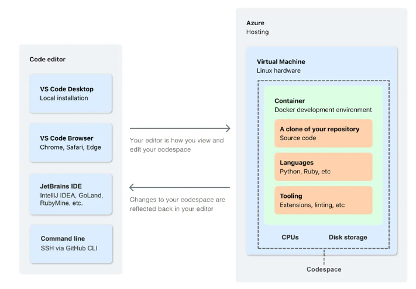

你可以从浏览器、Visual Studio Code、JetBrains Gateway 应用程序或使用 GitHub CLI 连接到 Codespaces。就像在本地开发一样，Codespaces 可以保存你所做的代码修改和文件更改，即使停止了 Codespaces，也可以在以后继续使用。除非你将 Codespaces 删除，否则它将一直占用云上的资源。

## 如何创建 Codespaces

你可以从项目仓库或现有模板创建 Codespaces。如果你从项目仓库创建 Codespaces，它会自动将仓库克隆到开发环境中。如果仓库中包含 `.devcontainer` 文件夹，则说明项目作者为该项目创建了标准的 Codespaces 配置。在创建 Codespaces 时，将自动使用此配置创建容器。

### 为储存库创建

进入储存库，点击左上角的 “Code” ，在 “Codespaces” 标签中点击 “Create Codespaces on {fork-name}”

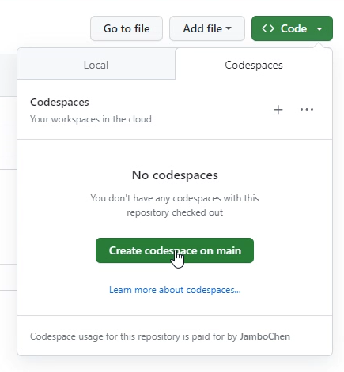

如果你要做关于服务器地区、核心数量的设置，也可以在 “New with options...” 中进行设定。

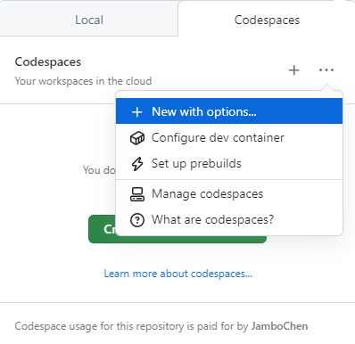
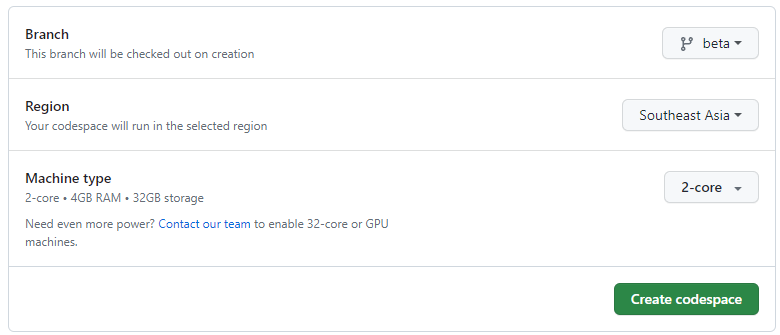

### 从模板创建

我们可以从 GitHub 页首的 `Codespaces` 进入此页面，其中包含了官方提供的一些模板，你也可以在其中管理你的 Codespaces。

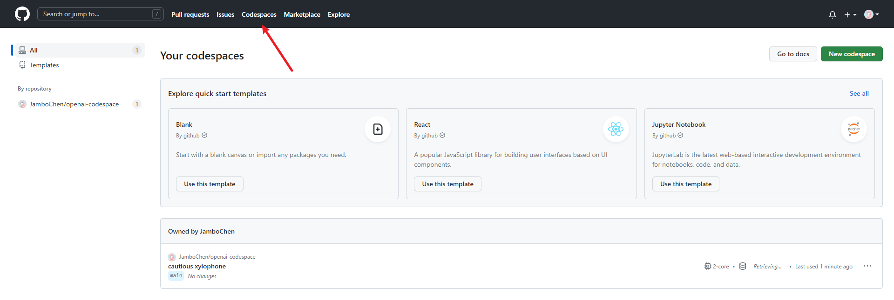

在“See all” 中可以查看完整的模板列表，点击模板的黑体名字也可以查看模板 储存库。

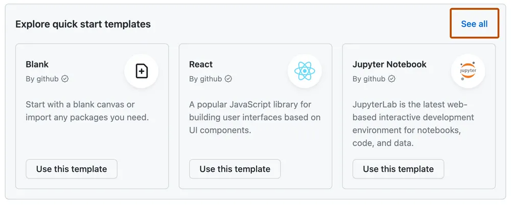

点击“Use this template”就可以根据模板创建 Codespaces 。如果你在模板储存库也可以在 “Use this template” 中点击 “Open in a Codespaces” 创建。

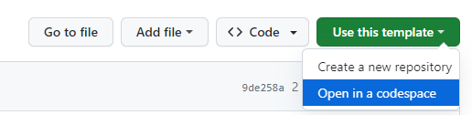

## 配置 Codespaces

Codespaces 是运行在 Docker 容器中的，因此你可以为储存库配置专门的开发环境。Codespaces 的配置文件是 `devcontainer.json` ，通常位于 `.devcontainer` 目录中。你可以创建多个配置文件，但是这种情况下它们需要储存在各自的子目录中，例如：

- `.devcontainer/database-dev/devcontainer.json`
- `.devcontainer/gui-dev/devcontainer.json`
当你进入 Codespaces 时，呼出 VS code 的命令面板（`ctrl`+`shift`+`P`），键入 “add dev” ，并点选。

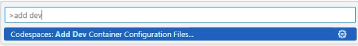

选择 “Create...” 以创建新的配置，如果你要编辑现有的配置文件就选择 “Modify...”。

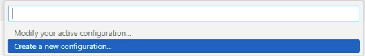

选择 “Show All Definitions...”。

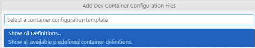

接下来根据自己的需要选择环境，这里我选择 “Python 3”，然后选择你想要的版本。

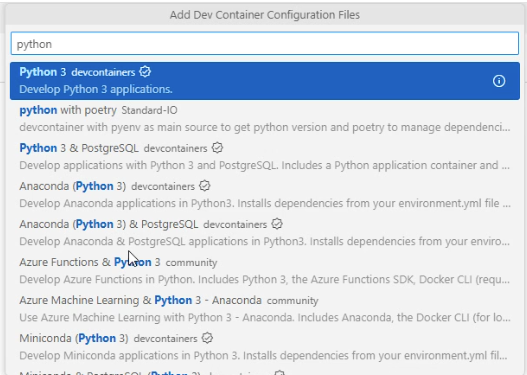

然后选择你想要添加的功能，比如环境管理工具 “Conda”。

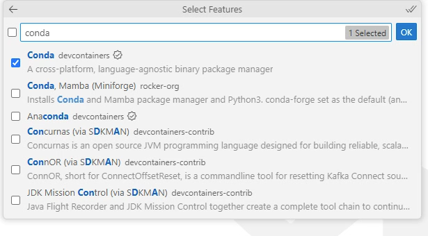
你还可以将 VS code 拓展添加进配置中。

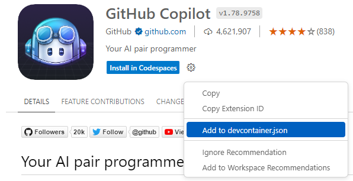

为了让 conda 可以顺利初始化，我们需要修改 `devcontainer.json` 中的 `postCreateCommand` 参数，这个参数是第一次创建 Codespaces 时会执行的命令。关于其他参数可以参考 [metadata reference](https://containers.dev/implementors/json_reference/)。

```json
    "postCreateCommand": "conda init && source ~/.bashrc"
```

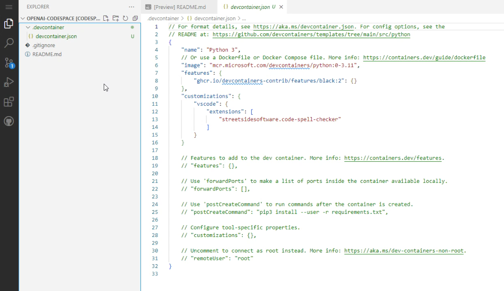

我们呼出命令面板，输入 “rebuild” 让他重新构建。

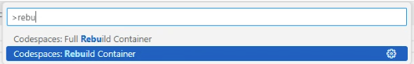

等他构建完成后，可以看到他已经自动安装了 Python 相关的拓展。

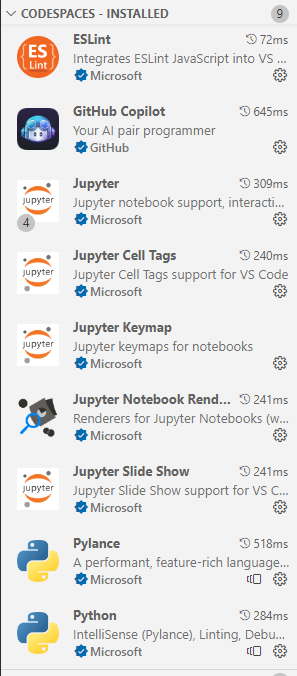

并且 conda 也可以正常使用了，我们可以创建一个新的 python 环境。

```bash
$ conda create -n openai python=3.11
...
Proceed ([y]/n)? y
...
$ conda activate openai
```

这时我们就可以在 “openai” 这个环境中进行开发。我们首先安装一些需要的库。

```bash
pip install openai
```

我们开一个 Jupyter 来做个示例。首先需要选择正确的内核，点击左上角的 “Select Kernel”，“Select Another Kernel”，“Python Env...”，选择 “openai”，如果你先前创建的 conda 环境不在此列表中，可以点击左上角的刷新键来刷新。

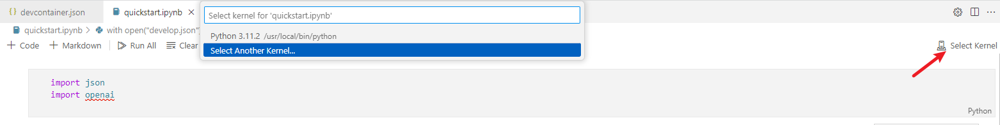
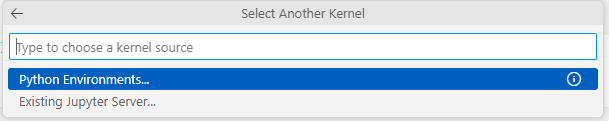
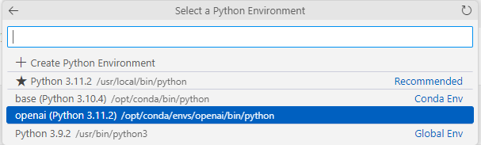

我在 Azure 上开了一个 OpenAI 服务，将 Key 等相关数据储存在 `develop.json` 中，然后通过 `openai` 库调用 API。

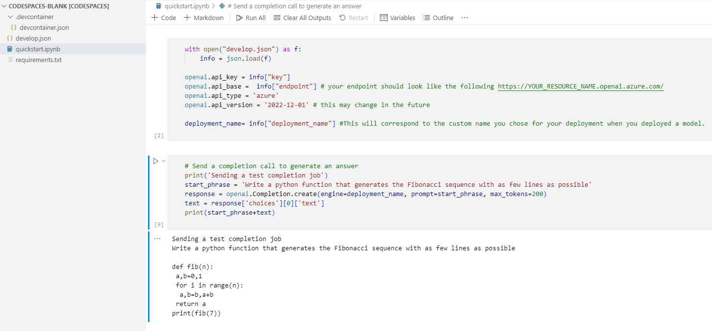

如果你更习惯 Jupyter 的界面，而不是 VS code，Codespaces 也支持端口转发。

```bash
pip install jupyterlab
jupyter lab
```

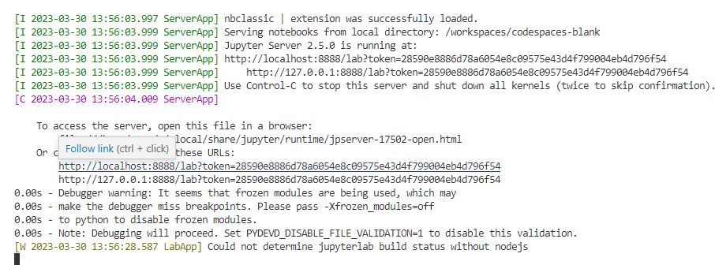
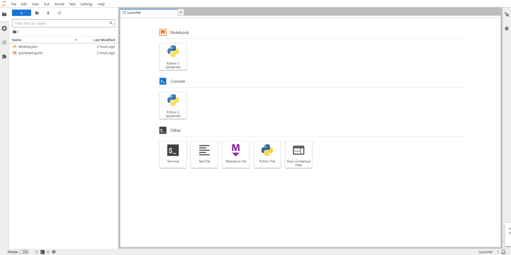
你可以在 Terminal 的 PORTS 页面中查看转发的端口。只要 CodeSpaces 是开启状态，你就可以通过对应的网址访问端口。
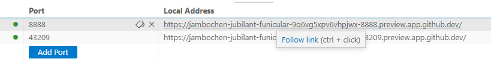
如果你想让其他人也能够访问端口，你还可以将端口设为公开，此时即使是没有登录 GitHub 的情况下也可以进入网页。
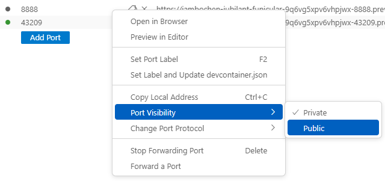

## 管理 Codespaces

在使用 Codespaces 时，会产生计算费用和储存费用。为了避免不必要的损失，你需要记得停止或关闭 Codespaces。当停止 Codespaces 时将不会产生计算费用，但是仍会产生储存费用。

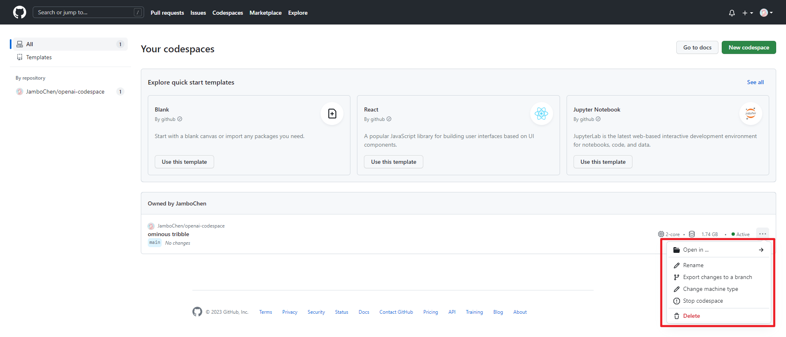

如果你的 Codespaces 是从模板创建的，你可以在管理页面中将其内容发布到储存库中。请注意，如果你要将 Codespaces 发布到储存库中，Codespaces 需要处于停止状态。

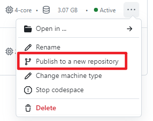

选择“公开”或者“私人”后点击创建即可。

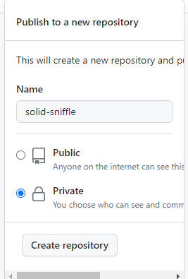

除了发布和删除 Codespaces，管理页面还可以让你查看和修改 Codespaces 的配置信息，如 Docker 镜像、环境变量等。此外，你还可以查看与 Codespaces 相关的费用信息，以及访问控制等设置。即使停止 Codespaces，他也会将你的更改保存下来，除非你将其删除，才会彻底释放在云上的资源。

项目地址：[https://github.com/JamboChen/codespases-Jambo](https://github.com/JamboChen/codespases-Jambo)

## Azure ML 是什么

如果你需要进行深度学习或 CUDA 方面的开发，那么一定少不了要安装各种驱动和库，这是个十分繁琐的工作。而 Azure 机器学习可以帮助你快速搭建一个 GPU 加速的环境，可以让你直接进行相关的开发。

## 创建 Azure ML

对于学生党，可以参考我上一篇教程 [注册 Azure 和申请 OpenAI](http://t.csdn.cn/Wg89x) 来创建 Azure 账号，可以获得 Azure 100 美金的免费额度。

进入 Azure 首页，上方搜索框中输入 “机器学习”，点击 “Azure 机器学习”。

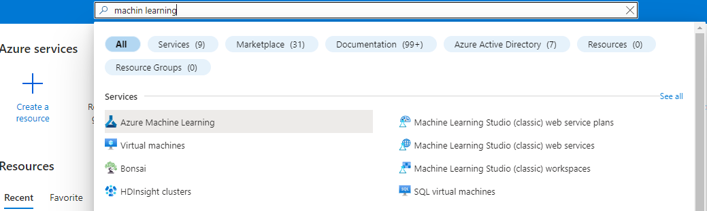

点击 “创建”。

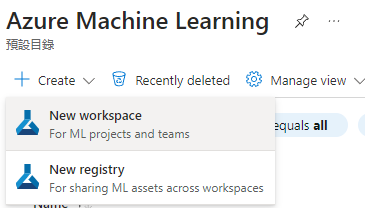

在 “创建 Azure 机器学习工作区” 页面中，你可以选择你的订阅，以及工作区的名称、位置、资源组等信息。要注意的是，如果你需要 GPU 资源， 那么地区一定要选择 “West US 2”

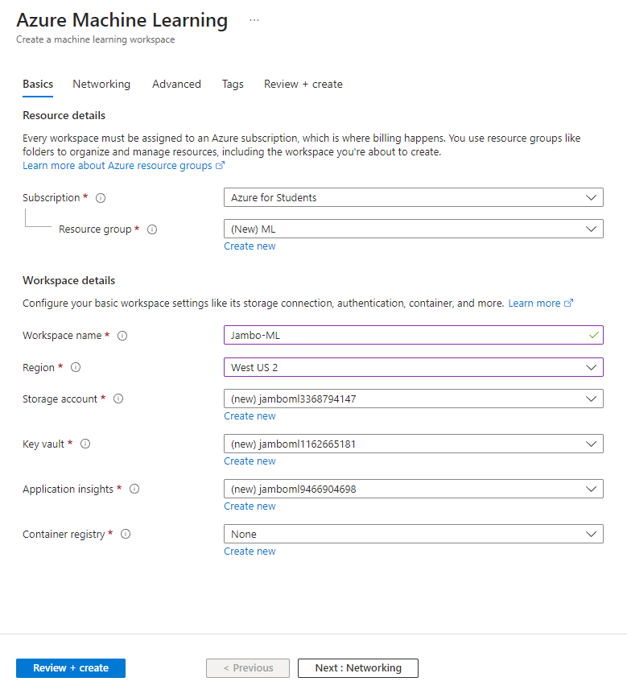

确认无误后点击 “审阅和创建”，再次确认后点击 “创建”。等待创建完成后，你就可以进入 Azure 机器学习的管理页面了。

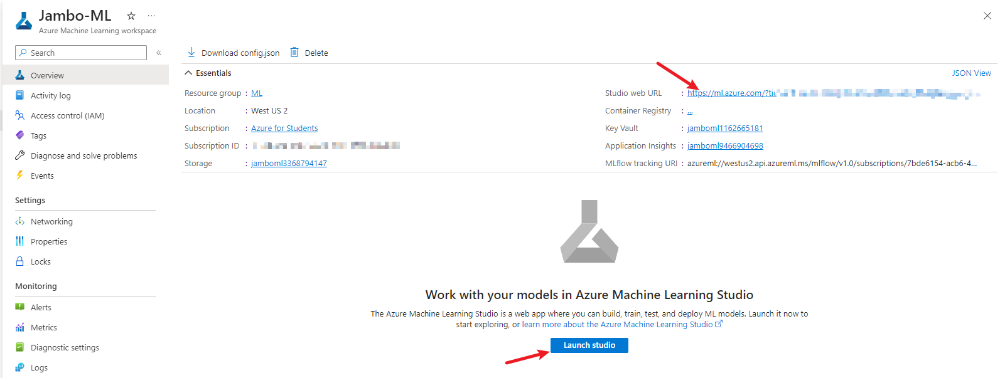

在左侧菜单的 “计算” 页面中，点击 “新建”。

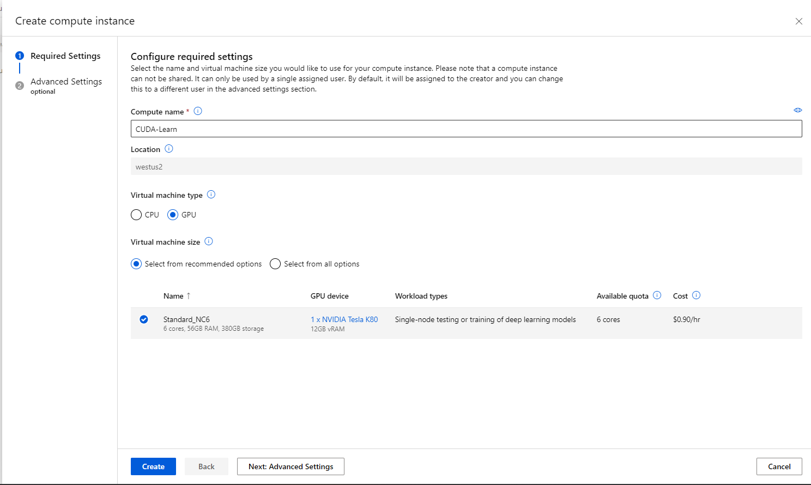

根据你的需要选择虚拟机类型，这里我选择 “GPU”，他默认使用 Tesla K80 GPU，如果你需要更高性能的 GPU，可以选择 “从所有选项中选择”。但你可能需要申请配额。点击创建后稍等片刻就创建成功了

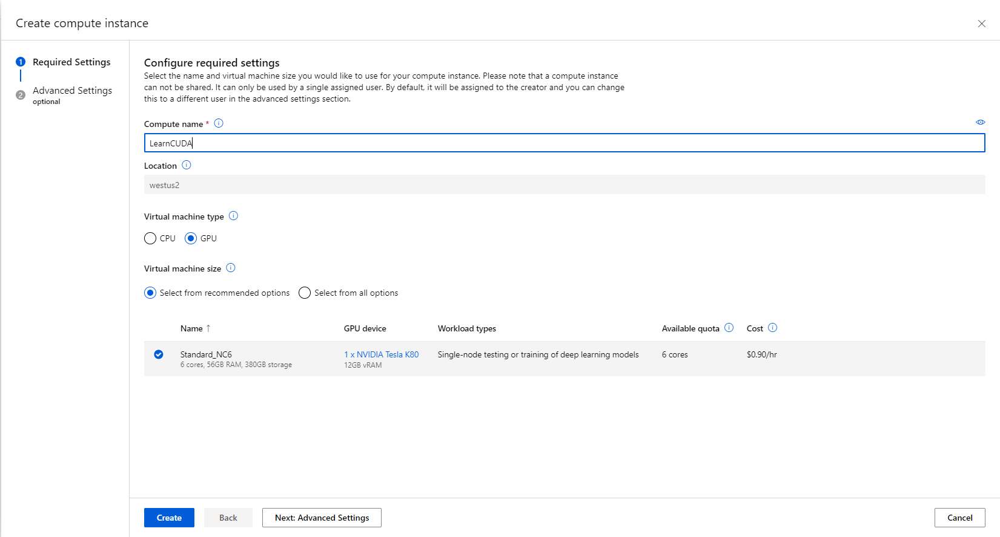

我们可以转到 “Notebooks” 页面，点击 Terminal，进入终端。输入 `nvcc --version` 来查看 cuda 的信息。

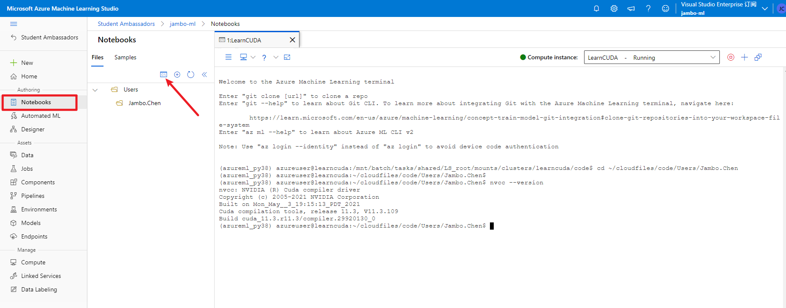

接下来我们新建一个 `helloworld.cu` 文件。

```bash
nano helloworld.cu
```

输入以下代码，`Ctrl` + `X` 退出，`Y` 保存，`Enter` 确认。

```cuda
#include <stdio.h>
__global__ void helloFromGPU()
{
    printf("Hello World! from thread [%d, %d]\
            block [%d, %d]\n",
           threadIdx.x, threadIdx.y,
           blockIdx.x, blockIdx.y);
}

int main()
{
    printf("Hello World! from CPU\n");

    // declare a 2D grid and 2D block
    dim3 block(1, 2);
    dim3 grid(1, 2);

    // launch the kernel on the device
    helloFromGPU<<<grid, block>>>();

    // wait for all previous operations to complete
    cudaDeviceSynchronize();

    return 0;
}
```

运行编译命令。要注意的是由于 K80 架构较旧，所以我们需要指定架构，否则将无法正确执行 GPU 相关的代码。

```bash
nvcc -arch=sm_37 helloword.cu -o helloword
./helloword
```

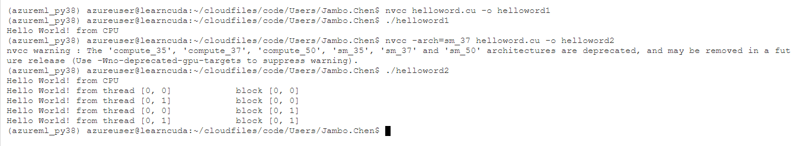

架构相关的信息可以参考下图：

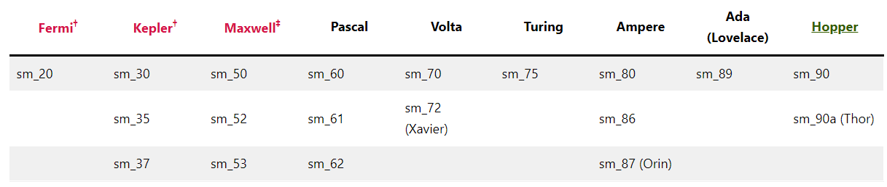

在这个页面上，还可以创建 ipynb 文文件。

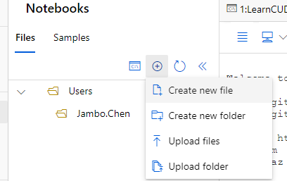
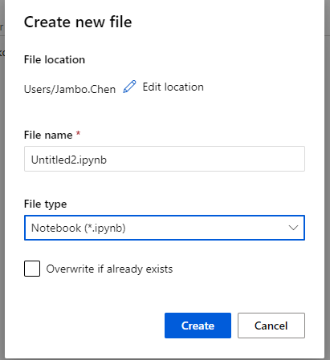
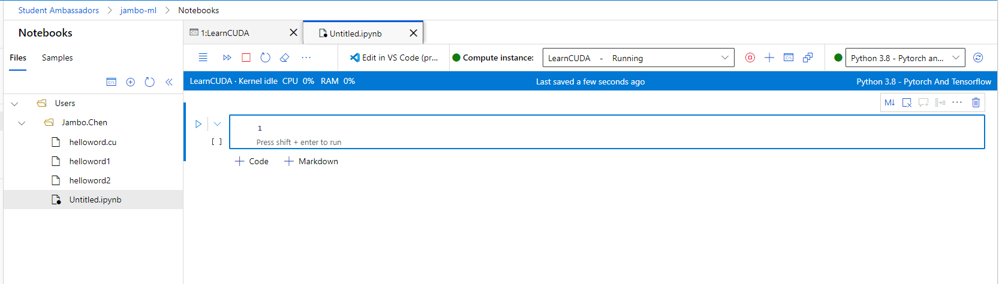

当然如果你更习惯 Jupyter 的界面，也可以从 “计算” 页面中进入。

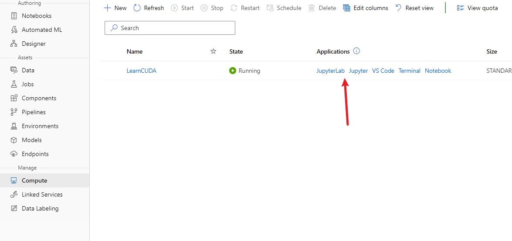

最后 Azure ML 是计时收费的，所以如果你有段时间不使用，可以将其停止，以免产生不必要的费用。

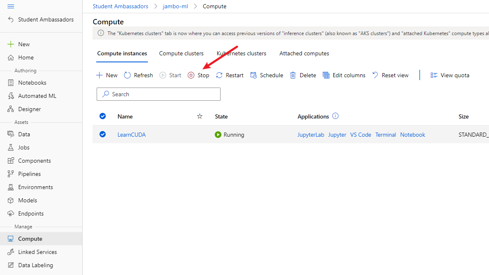
