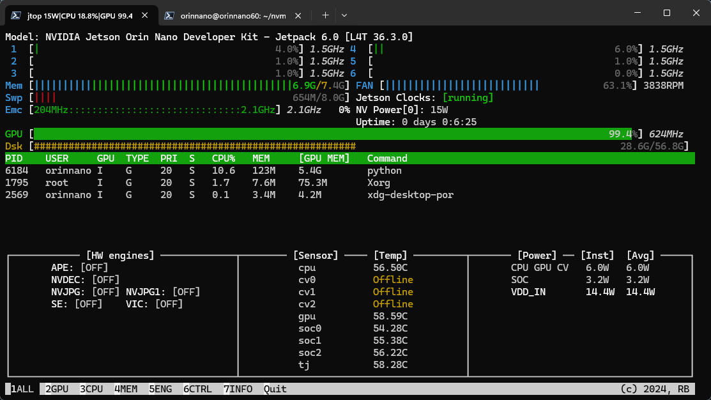
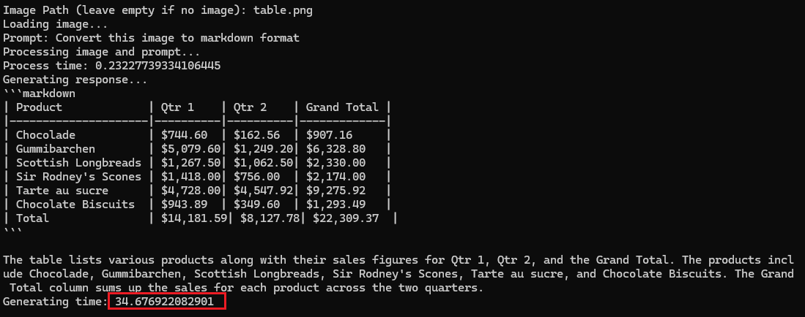

# 在 Jetson 平台上通过 ONNX 运行 Phi-3-vision 模型

本文的目标是在 Jetson 平台上运行 ONNX 格式的 Phi-3-vision 量化模型，并能够成功推理图片+文本的对话任务。

## Jetson 是什么

Jetson 平台是由 NVIDIA 推出的一系列小型 arm64 设备，具备强大的 GPU 运算能力，专为边缘计算和人工智能应用设计。它使用 Linux 系统，能够在低功耗的情况下执行复杂的计算任务，非常适合开发嵌入式 AI 和机器学习项目。

对于其他版本的 Phi-3 模型，我们可以使用 [llama.cpp](https://github.com/ggerganov/llama.cpp) 转换成 GUFF 格式运在 Jetson 平台上运行，并随意切换不同量化。或者可以直接方便的使用基于 llama.cpp 的 [ollama](https://ollama.com/library/phi3) 或 [llamaedge](https://llamaedge.com/) 服务。更多信息可以参考 [Phi-3CookBook](https://github.com/microsoft/Phi-3CookBook)。

但对于 vision 模型，现在还并没有办法转换成 GUFF 格式（[#7444](https://github.com/ggerganov/llama.cpp/issues/7444)）。而资源有限的边缘设备又难以通过 transformer 运行没有量化的原始模型。因此我们可以使用 ONNX Runtime 来运行 ONNX 格式的量化模型。

## ONNX Runtime 是什么

[ONNX Runtime](https://onnxruntime.ai/) 是一个高性能的推理引擎，用于加速和执行ONNX（Open Neural Network Exchange）格式的 AI 模型。而 [onnxruntime-genai](https://github.com/microsoft/onnxruntime-genai) 是一个专门针对 LLM（Large Language Model）模型构建的 API，它提供了一种简单的方式运行 Llama、Phi、Gemma、Mistral。

到文章撰写时，onnxruntime-genai 仍没有针对 aarch64 + gpu 的预编译版本，因此我们需要自行编译。

## 编译 onnxruntime-genai

文章撰写环境：

- [Jetpack 6.0 [L4T 36.3.0]](https://developer.nvidia.com/embedded/jetpack-sdk-60)
- 编译平台：Jetson Orin
- 推理平台：Jetson Orin Nano

### 克隆 onnxruntime-genai 仓库

```bash
git clone https://github.com/microsoft/onnxruntime-genai
cd onnxruntime-genai
```

### 安装 ONNX Runtime

从 [github release](https://github.com/microsoft/onnxruntime/releases) 页面下载 aarch64 版本的 ONNX Runtime，并解压得到头文件和必要的库文件。

> 注意：确保下载的是 aarch64 版本。如果有更新的版本，可以替换链接中的版本号。

```bash
wget https://github.com/microsoft/onnxruntime/releases/download/v1.18.1/onnxruntime-linux-aarch64-1.18.1.tgz
tar -xvf onnxruntime-linux-aarch64-1.18.1.tgz
mv onnxruntime-linux-aarch64-1.18.1 ort
```

ONNX Runtime 并没有提供 aarch64 + GPU 的预编译版本，但我们可以从 [dusty-nv](https://github.com/dusty-nv/jetson-containers/tree/master/packages/onnxruntime) 提供的镜像中获取所需的库文件。

以下命令将从 dusty-nv 的镜像中复制所需的库文件到 ort/lib 目录。

```bash
id=$(docker create dustynv/onnxruntime:r36.2.0)
docker cp $id:/usr/local/lib/libonnxruntime*.so* - > ort/lib/
docker rm -v $id
```

### 编译 onnxruntime-genai

目前你的位置应该仍在 `onnxruntime-genai` 目录下。

现在我们要准备构建 Python API。你可以使用 `>=3.6` 的 Python 进行编译。JetPack 6.0 默认安装的是 Python 3.10，但你仍可以切换到其他版本进行编译。编译出的 whl 将只能安装在编译时使用的 Python 版本上。

> 注意：编译过程会需要大量内存。因此如果你的 Jetson 设备内存较小（如 Orin NX），不要使用 --parallel 参数。

```bash
python3 build.py --use_cuda --cuda_home /usr/local/cuda-12.2 --skip_tests --skip_csharp [--parallel]
```

构建的文件会在 `build/Linux/Release/dist/wheel` 目录下，而我们只需要 `.whl` 文件。

你可以将 whl 文件复制到其他相同环境（CUDA，TensorRT ）的 Jetson 平台上进行安装。

> 注：生成的子目录可能会有所不同，但我们只需要 `build` 目录下的 `.whl` 文件。

### 安装 onnxruntime-genai

如果你有多个 CUDA 版本，你可能需要先设定环境变量 `CUDA_PATH`，并且确保指向的版本与编译时的版本一致。

```bash
export CUDA_PATH=/usr/local/cuda-12.2
```


你可以导航到 whl 文件所在目录，也可以将 whl 文件复制到其他目录用以下命令安装。

```bash
pip3 install *.whl
```

## 运行 Phi-3-vision 模型

### 下载模型

我们可以从 [huggingface](https://huggingface.co/microsoft/Phi-3-vision-128k-instruct-onnx-cuda) 下载针对 onnx-cuda 的 Phi-3-vision 模型。

```
pip install huggingface-hub[cli]
```

FP16 模型需要 8 GB 的显存，如果你在 Jetson Orin 这类资源较宽裕的设备上运行，可以选择下载 FP32 模型。

Int 4 模型是经过量化的模型，它只需要 2 GB 的显存。因此如果你在 Jetson Orin Nano 这类更为紧凑的设备上运行，可以选择下载 Int 4 模型。

```bash
huggingface-cli download microsoft/Phi-3-vision-128k-instruct-onnx-cuda --include cuda-fp16/* --local-dir .
# 或者
huggingface-cli download microsoft/Phi-3-vision-128k-instruct-onnx-cuda --include cuda-int4-rtn-block-32/* --local-dir .
```

### 运行示例脚本

下载官方的示例脚本并运行

```bash
# 下载示例脚本
wget https://raw.githubusercontent.com/microsoft/onnxruntime-genai/main/examples/python/phi3v.py
# 下载示例图片
weget https://onnxruntime.ai/images/table.png
```

运行示例脚本

```bash
python3 phi3v.py -m cuda-int4-rtn-block-32
```

首先输入图片的路径，比如 `table.png`


接下来输入提示文本，比如：`Convert this image to markdown format`

```text
```markdown
| Product             | Qtr 1    | Qtr 2    | Grand Total |
|---------------------|----------|----------|-------------|
| Chocolade           | $744.60  | $162.56  | $907.16     |
| Gummibarchen        | $5,079.60| $1,249.20| $6,328.80   |
| Scottish Longbreads | $1,267.50| $1,062.50| $2,330.00   |
| Sir Rodney's Scones | $1,418.00| $756.00  | $2,174.00   |
| Tarte au sucre      | $4,728.00| $4,547.92| $9,275.92   |
| Chocolate Biscuits  | $943.89  | $349.60  | $1,293.49   |
| Total               | $14,181.59| $8,127.78| $22,309.37  |
```

The table lists various products along with their sales figures for Qtr 1, Qtr 2, and the Grand Total. The products include Chocolade, Gummibarchen, Scottish Longbreads, Sir Rodney's Scones, Tarte au sucre, and Chocolate Biscuits. The Grand Total column sums up the sales for each product across the two quarters.
```

> 注：每次运行脚本的首轮对话可能会比较慢。后续对话会更快。

我们可以用 [Jtop](https://github.com/rbonghi/jetson_stats) 查看资源的使用情况：



以上推理演示是在 Jetson Orin Nano 上运行，使用 Int 4 量化模型。可以看到 Python 进程占用了 5.4 GB 显存来运行推理，而在推理过程中 CPU 几乎没有负载，GPU 则几乎满载。

我们可以修改示例脚本，给一些关键节点用 `time` 函数计时，可以看到推理的速度是非常快的。



而这一切都仅仅是在一台功耗只有 15W 的设备上完成的。