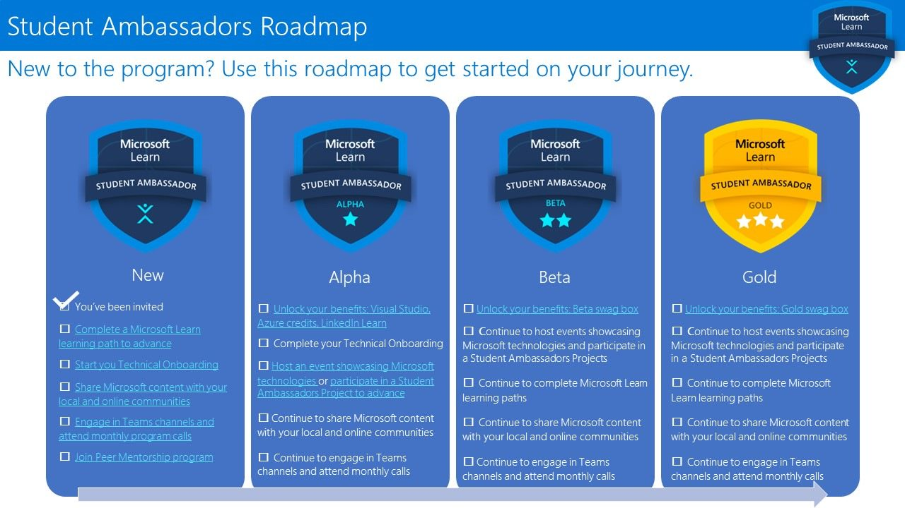
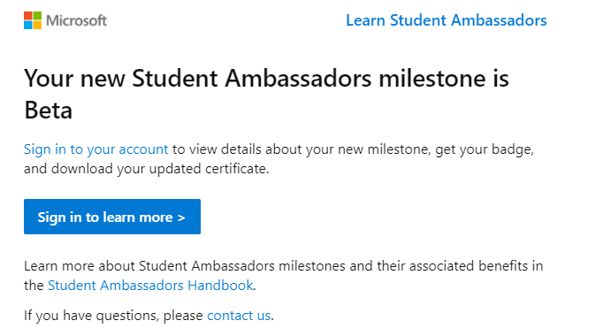

# Microsoft 学生大使

学生大使计划由Microsoft发起，旨在培养和支持全球范围内的年轻领导者。作为学生大使，我们有机会代表 Microsoft 在学校和社区中扮演积极的角色，与其他有着相同激情的学生共同学习、合作和成长。

学生大使分为 4 个阶段：New、Alpha、Beta 和 Gold，每个阶段都有对应的福利和要求。当然，除了学生大使的福利以外，你还能用 edu 邮箱去申请 Azure、Github 的学生福利。

当你成功申请成为学生大使并成功入职后，便会进入 New 阶段，同时你也能**获得 M365 作为福利**。在这个阶段，你只需要完成一些很简单的任务，比如完成一个 Microsoft Learn 路径，就能进入到下一阶段。

在晋升到 Alpha 后，你将获得 **Visual Studio 企业版，以及每月 150 美元的 Azure 额度等**福利。而想要升级到 Beta，你需要完成一些更具挑战性的任务，比如举办活动，以证明你的影响力。在升级到 Beta 后，你将收到 Microsoft 的 **Beta 礼品包**。最后，如果你想要升级到 Gold，你需要保持活跃度，举办更多的活动，进行更多的社区贡献。Gold 的申请是在每年的 12 月和 6 月进行审查，如果你成功升级到 Gold，你将获得更多的福利，比如 Gold 礼品包、微软最有价值专家提名等。

# 我在升级到 Beta 前做了什么？

在从 Alpha 升级至 Beta 的过程中，最显著的变化就是影响力的扩大。Alpha 阶段仅仅是个人的成长，而成为 Beta 后，我们需要将 Microsoft 的技术传播给他人，成为技术的传播者和倡导者。然而，要成功升级至 Beta，仅仅撰写博客是不够的，虽然这也是一项不可或缺的任务。更重要的是，我们需要具备举办活动的能力，将技术传播给他人。这也是评估我们是否适合升级至 Beta 的重要标准。我理解有些人可能觉得自己社交恐惧、不善言辞、不擅长交际或组织活动，但这些并非无法克服的问题。我们可以通过学习、成长和不断提升自己的能力来克服这些困难。我自己也曾经是一个社交恐惧的人，但如今我已经能够组织活动，这意味着你也可以做到。下面我就来分享一下我从 Alpha 提升到 Beta 的路程。

我成功升级至 Alpha 阶段后，我便开始着手编写与 Microsoft 相关的博客，包括了 CodeSpace、AzureML 等内容，并发布在 CSDN，dev.to 上。其中，我将注意力集中在 Azure OpenAI Server 上，因为在此之前，我通过使用 edu 邮箱成功申请了这项内部服务的使用权限。为了支持这一服务，我编写了一系列的教程，以便其他人能够充分利用它。

在四月份，我受到微软的卢老师的邀请，参加了微软 Reactor 的直播演讲。在一个小时演讲中，我结合之前编写的教程，分享了我使用 Azure OpenAI 的心得。这次机会也让我有机会申请升级至 Beta 阶段。

具体来说，我下载了演讲在 B 站的回放，并将其上传至学生大使的 OneDrive。然后，我登录[学生大使的网站](https://studentambassadors.microsoft.com/)，进入"我的账户"，点击"Events"，选择"Add Event"，填写相关信息，并将视频的 OneDrive 共享链接添加到活动详情中，最后提交了申请。第二天早上，学生大使 PM 通过 Teams 联系我，询问是否有任何能够支持参与人数的证据。于是，我将演讲回放的播放次数截图和视频链接发送给他，并解释了当时直播中没有记录参与人数的原因。幸运的是，PM 回复说证据是有效的，并批准了我的升级申请（"This screenshot actually works! Approved. This qualified you for Beta Advancement. CONGRATULATIONS!!"）。隔天早上，我收到了升级至 Beta 的确认邮件。

# 新的起点

Beta 仅仅是一个开始。在我成功升级到 Beta 阶段后，我意识到这只是我个人成长和发展道路上的新起点。成为一个技术传播者和倡导者，我的责任不仅仅是将 Microsoft 的技术传播给他人，更是激励和影响更多的人踏上技术的旅程。我也将会把 Gold 作为我的下一个小目标前进。

对于那些即将踏入学生大使计划的同学，我想传递一些勉励和启示。首先，不要害怕迎接挑战和面对困难。在成长的过程中，我们经常会面临新的技术、新的任务和新的要求。但是，正是通过挑战和困难，我们才能不断突破自我，取得进步。

其次，团队合作是成功的关键。与其他学生大使和志同道合的人紧密合作，共同学习、探索和成长。相互支持和鼓励，共同创造出更大的影响力和成就。

此外，持续学习和提升自己的能力也是非常重要的。技术在不断发展和变化，我们需要保持敏锐的观察力和学习的态度。通过参加培训、学习课程和参与项目，我们可以不断拓宽自己的技术领域，为他人提供更好的帮助和支持。

最后，不要忘记分享和帮助他人。作为学生大使，我们有机会影响和激励其他人，帮助他们实现潜力。通过举办活动、编写教程、分享经验，我们可以为更多人铺平道路，让他们在技术领域取得成功。